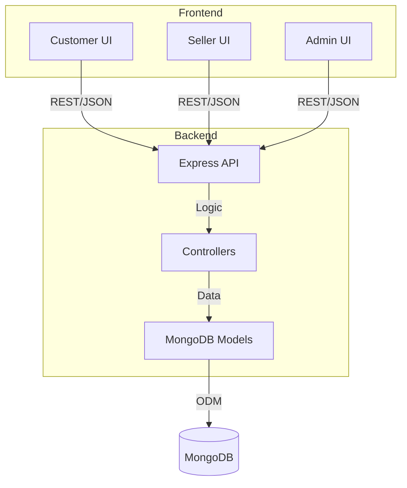
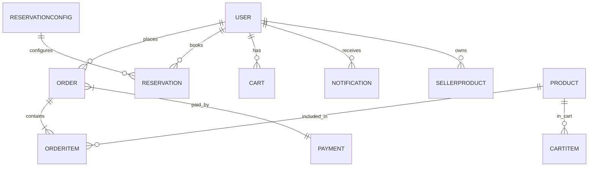
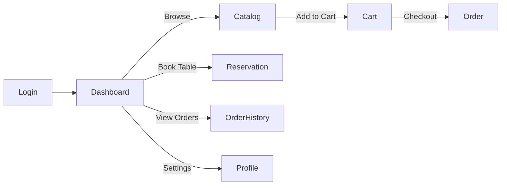

# Wine Pub Management System

## 🏗️ System Overview

Wine Pub Management System is a full-stack, role-based platform for managing a modern wine pub, including catalog, orders, reservations, payments, and analytics. It supports three main user roles: **Customer**, **Seller**, and **Admin**.

---

## 🛠️ Technology Stack

| Layer      | Technology                                    |
|----------- |-----------------------------------------------|
| Frontend   | React (Vite, TypeScript), Tailwind CSS, MUI, Radix UI |
| Backend    | Node.js, Express.js, JWT, REST API            |
| Database   | MongoDB (Mongoose ODM)                        |
| Auth       | JWT, bcryptjs, Role-based access              |
| Email      | Nodemailer                                    |
| Dev Tools  | Vite, ESLint, Prettier                        |

---

## 🗂️ Monorepo Structure

```text
Wine-Pub-Management-System/
├── backend/      # Express API, MongoDB models, controllers
│   └── src/
│       ├── models/         # User, Product, Order, Cart, etc.
│       ├── controllers/    # Business logic
│       ├── routes/         # API endpoints
│       ├── middleware/     # Auth, error handling
│       └── seed/           # Demo data
├── frontend/     # React + Vite client app
│   └── src/
│       ├── app/            # App, routes, layouts
│       ├── pages/          # Page components (Dashboard, Cart, etc.)
│       ├── components/     # UI components
│       └── styles/         # Tailwind, CSS
└── README.md
```

---

## 👤 User Roles & Features

### 1. Customer
- Browse wine, bites, and beverages catalog
- Add to cart, checkout (pickup/delivery)
- Make reservations (table booking)
- Track orders, view order history
- Manage profile & settings

### 2. Seller
- Manage own product listings (wines, bites, etc.)
- View and process orders
- Analytics dashboard (sales, stock)
- Update business profile & settings

### 3. Admin
- Manage all users (customers, sellers, admins)
- Approve/reject seller registrations
- Manage full catalog (wines, bites, etc.)
- View and manage all orders, reservations
- System analytics (KPIs, performance)
- Configure system-wide settings

---

## 🌟 Main Features

- **Authentication:** JWT-based, role-aware login/register
- **Product Catalog:** Wines, bites, beverages, foods (with images, pricing, stock)
- **Cart & Checkout:** Add to cart, select size, pickup/delivery, order tracking
- **Reservations:** Table booking with time slots, guest count, special requests
- **Order Management:** Status tracking, payment integration, notifications
- **Admin Panel:** User, seller, product, order, and analytics management
- **Seller Panel:** Product management, order processing, analytics
- **Notifications:** Seller registration, order alerts, admin messages
- **Responsive UI:** Modern, mobile-friendly design

---

## 🗺️ System Architecture



---

## 🧑‍💻 API Endpoints (Sample)

| Endpoint                  | Method | Description                       |
|-------------------------- |--------|-----------------------------------|
| /api/auth/register        | POST   | Register new user                 |
| /api/auth/login           | POST   | Login user                        |
| /api/wines                | GET    | List all wines                    |
| /api/bites                | GET    | List all bites                    |
| /api/cart                 | GET    | Get user cart                     |
| /api/reservations         | POST   | Create reservation                |
| /api/orders               | POST   | Place order                       |
| /api/payments/process     | POST   | Process payment                   |
| /api/admin/analytics      | GET    | Admin analytics dashboard         |

---

## 🗃️ Data Model Overview



---

## 🚦 User Flow Diagram



---

## 🚀 Getting Started

### 1. Backend
```bash
cd backend
cp .env.example .env
npm install
npm run dev
```

### 2. Frontend
```bash
cd frontend/src
npm install
npm run dev
```

### 3. Seed Demo Data
```bash
cd backend
npm run seed
```

---

## 📬 Contact & Credits

- Built with ❤️ by your team
- See ATTRIBUTIONS.md for assets and libraries